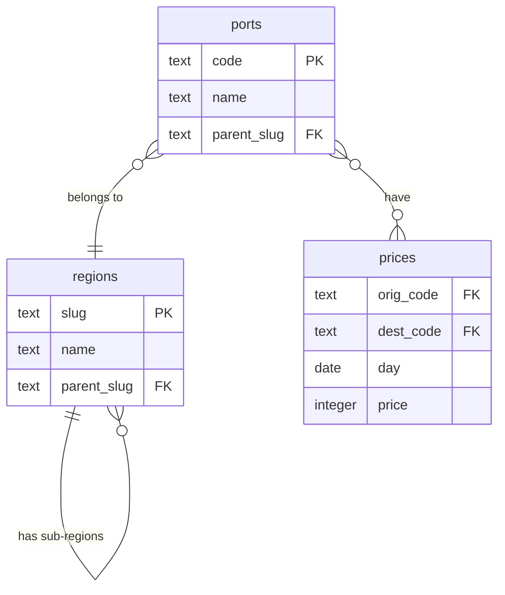

# Xeneta's Assignment - Rates API

This is an implementation proposal for Xeneta's Rate API task .

## Requirements

Given the following database schema:




The functionality to implement is an API endpoint that takes the following parameters:

* date_from
* date_to
* origin
* destination

and return a list with the average prices for each day on a route between _origin_ and _destination_. For days on which there are less than 3 prices in total, it returns null. Both the _origin_, _destination_ params accept either port codes or region slugs, making it possible to query for average prices per day between geographic groups of ports.

For the non-functional requirements, it focuses on few key areas:

1. The solution must be written in Python and SQL (ORMs can be used but the gross part must be SQL).
2. A Version Control System must be used.
3. It must include proper documentation.
4. The database can be modified/extended to adapt to the required task.

## Implementation proposal

The chosen tech stack for this project is FastAPI with SQLAlchemy and Alembic for the database part. As for the RDBMS, I migrated the provided `Dockerfile` to a `docker-compose.yml` file to easily manage the tech stack. The implemented endpoint strictly follows the specification and no other additional functionality was provided.

Regarding the database model, some additional optimization have been put into place to make queries more efficient.

Additionally, some (very) basic logging is implemented in order to enable some type of observability.

Finally, a simple CI pipeline (using GitHub Actions) has been put in place to ensure tests are run before and after merging into long-lived branches.

<details>
   <summary>In depth analysis of the queries and its optimizations</summary>

#### Initial approach

For the given task, the naive approach would be to have a simple query such as this one:

```sql
select day, round(avg(price)) as average_price
from prices
where
    orig_code = :origin and dest_code = :destination and day between :date_from and :date_to
group by day
having count(*) >= :min_prices_per_day
order by day
```

However, if we set our variables to be the same as in the assignment's example, we will notice that a query like this will not return anything. Indeed, this happens because **we are only filtering by the port code, and cannot filter by a region**. By changing the example's destination to, for example, `'NOTRD'`, we will also observe that there are some omitted days, which happens because the query will not return records for days when there are no prices or these are less than `:min_prices_per_day`.

To solve the first challenge, being able to query by port code and region slug, we can use a (somewhat) advanced SQL concept: [Recursive CTEs](https://learnsql.com/blog/sql-recursive-cte/). An initial approach to have a hierarchy of regions would be the following:

```sql
with recursive
    region_hierarchy as (
        -- Start with the initial regions (origin and destination).
        select slug
        from regions
        where slug = :port_or_region
        union all
        -- Recursively add all children regions.
        select r.slug
        from regions r
        join region_hierarchy rh on r.parent_slug = rh.slug
    )
-- Use the port code if it's a port code indeed.
select code, name, parent_slug
from ports
where code = :port_or_region
union
-- Include all the ports in the origin region recursively (this is where
-- the magic happens).
select code, name, parent_slug
from ports
join region_hierarchy rh on parent_slug = rh.slug
```
With this approach, we can now see that the sample's destination region yields 8 results (concretely, 6 codes for the `'north_europe_main'` and 2 for the `'uk_main'` sub-region), and querying by a specific port code works as well. Note that we could either combine both origin and destination with a condition like `in (:origin, :destination)` or repeat the query for each variable (this turns out to be more performant).

As for the missing days, as we are using Postgres, we can generate a series of dates with `generate_series` and then join it like this:

```sql
with
    prices as (
        select day, round(avg(price)) as average_price
        from prices
        where
            orig_code = :origin
            and dest_code = :destination
            and day between :date_from and :date_to
        group by day
        having count(*) >= :min_prices_per_day
    )
select d.day, p.average_price
from
    (
        select
            generate_series(:date_from ::date, :date_to ::date, '1 day' ::interval)::date
            as day
    ) as d
left join prices p on d.day = p.day
order by day


```

> [!TIP]
> Another alternative approach for this query would be to create a `days` dimensional table (in Kimball's Dimensional Data Modelling terms) that would have all the possible days pre-computed. This would make sense especially for RDBMS that would not have the `generate_series` function or if the queries used a wide date range.

After solving each part and combining both approaches, we get to the following query:

```sql
with recursive
    origin_region_hierarchy as (
        select slug
        from regions
        where slug = :origin
        union all
        select r.slug
        from regions r
        join origin_region_hierarchy rh on r.parent_slug = rh.slug
    ),
    destination_region_hierarchy as (
        select slug
        from regions
        where slug = :destination
        union all
        select r.slug
        from regions r
        join destination_region_hierarchy rh on r.parent_slug = rh.slug
    ),
    origin_ports as (
        select code
        from ports
        where code = :origin
        union
        select code
        from ports
        join origin_region_hierarchy rh on parent_slug = rh.slug
    ),
    destination_ports as (
        select code
        from ports
        where code = :destination
        union
        select code
        from ports
        join destination_region_hierarchy rh on parent_slug = rh.slug
    ),
    avg_prices as (
        select day, round(avg(price), 0) as average_price
        from prices
        where
            orig_code in (select code from origin_ports)
            and dest_code in (select code from destination_ports)
            and day between :date_from and :date_to
        group by day
        having count(price) >= :min_prices_per_day
    ),
    dates as (
        select
            generate_series(
                :date_from ::date,
                :date_to ::date,
                '1 day' ::interval
            )::date as day
    )
select d.day, ap.average_price
from dates d
left join avg_prices ap on d.day = ap.day
order by d.day
;
```

> [!NOTE]
> In this case, this query expects all the parameters to be logically correct. In turn, the input validation utilizes a similar query, and is processed via application code. Check the commit 065395b69302bd4eff5d818b56f9387212834285 for more information.

#### Optimization

Although the query is not slow, mainly because of the few data entries available, it was certainly not optimized. Hence, by trying and analyzing several execution plans, I found the following tunings to be of (potential) help:

##### Avoiding the recursive CTE:
As the regions table is not expected to change much, we could create a materialized view to store the pre-computed region hierarchy:

```sql
CREATE MATERIALIZED VIEW mv_region_hierarchy AS
WITH RECURSIVE region_hierarchy AS (
    SELECT slug, parent_slug, 1 AS level
    FROM regions
    WHERE parent_slug IS NULL
    UNION ALL
    SELECT r.slug, r.parent_slug, rh.level + 1
    FROM regions r
    JOIN region_hierarchy rh ON r.parent_slug = rh.slug
)
SELECT * FROM region_hierarchy;

CREATE INDEX idx_mv_region_hierarchy_slug ON mv_region_hierarchy (slug);
CREATE INDEX idx_mv_region_hierarchy_parent_slug ON mv_region_hierarchy (parent_slug);
```

To use this materialized view, we must delete the recursive CTEs and modify its usages in `origin_ports` and `destination_port`:

```sql
with
    origin_ports as (
        select code
        from ports
        where code = :origin
        union
        select code
        from ports p
        join mv_region_hierarchy rh on p.parent_slug = rh.slug
        -- now the hierarchy filtering happens here:
        where rh.slug = :origin or rh.parent_slug = :origin
    ),
    -- same of destination_ports
[...]
```

Nevertheless, this approach varies a lot in terms of performance, so it is difficult to determine how helpful it is.

##### Additional indexes

Other than columns with primary keys, we were also filtering the `parent_slug` ones from both `regions` and `ports`. Therefore, creating some indexes on top of these would probably help:

```sql
CREATE INDEX idx_regions_parent_slug ON regions (parent_slug);
CREATE INDEX idx_ports_parent_slug ON ports (parent_slug);
```

In practice, as there is not enough data in these tables, the optimization engine chooses not to use these indexes, and performs sequential scans instead (forcing it to use them causes the query execution cost to rise, indeed). This situation might change in scenarios with bigger data volumes.

Besides the `region` and `port` tables, we also filter the columns present in `prices` to later calculate the average price. To optimize this, we can chose a (somewhat) advanced type of index: a Covering Index that includes the `price` the column. This way, we could calculate this average without having to access the table directly (at the expense of using additional storage):

```sql
CREATE INDEX idx_prices_covering ON prices (day, orig_code, dest_code) INCLUDE (price);
```

In this case, the optimization engine chooses to use this index, as it provides significant improvement.

##### Optimization comparison

After implementing these changes, the improvement varies on the query's parameters:

* For the assignment's sample query, we go from a cost of ~1500 to ~778 (a ~48% improvement).
* For a bigger query (from china_main to northern_europe, the whole month of January 2016), we go from a cost of ~2000 to ~1538 (a ~23% improvement).

While the speedup might not be very stable, it is clear that this approach outperforms the initial one. These results can be further improved by tuning some settings such as the `work_mem` parameter.

</details>

## Running the project

### Requirements
Before running the project, besides having Docker (with Docker Compose) installed, you need to:

1. Create one `.env` file (for the Docker Compose stack) in the root of the project (where `docker-compose.yml` is located).
2. Create one `postgres.env` file for the Postgres image and another `.app.prod.env` file for the API settings in the same location.
3. Optionally, create a development `.app.dev.env` (for the database) file if you want to.

#### .env file template
```dosini
PG_VERSION=16
DB_PORT=5432
APP_PORT=8080
```

#### postgres.env file template
```dosini
# Check https://hub.docker.com/_/postgres, Environment Variables section
POSTGRES_PASSWORD=supersecret
```


#### app.{dev,prod}.env file template
```dosini
DATABASE_URL=postgresql://postgres:supersecret@db/postgres
REDIS_URL=redis://localhost # or redis://redis
REDIS_PREFIX=fastapi-cache
CACHE_DEFAULT_EXPIRE=300
MIN_PRICES_PER_DAY=3 # Prices threshold to actually return an average for a specific day
MAX_DAYS_INTERVAL=31 # Max interval between date_from and date_to
LOG_LEVEL=INFO
```

### Setup
Once the required files have been set up accordingly, the project can be run with Docker Compose:

```console
$ docker compose up -d --build
```

Once the containers are up and running, you will be able to access the web by navigating to http://127.0.0.1:8080 (or whatever `APP_PORT` from `.env` value you set).


### Using the API

To access the HTTP API, navigate to http://127.0.0.1:8080 to be directly redirected to the Swagger-UI (http://localhost:8080/docs/), where the requested endpoint is described as a means of documentation and interactive playground.

In summary, here are some examples of cURL requests for each endpoint:

```console
$ curl -X POST -H "Authorization: Token YOUR_TOKEN" -F "image=@/path-to-some-image" -F "footnote=A footnote text" http://localhost:8080/api/submit/
$ # All query params are optional:
$ curl -X GET http://localhost:8080/api/list/?creator__username=pavel&ordering=created_at&search=dog
```

### Local development

To start the web server locally, you require to have [Poetry](https://python-poetry.org/) and [Python 3.12](https://www.python.org/). Additionally, you will need to have the database running. You can do so by passing the service you want to run in your Docker Compose stack like this:
```console
$ docker compose up -d db
```

First, install the project dependencies:

```console
$ poetry install
```

Then, start the development server:

```console
$ fastapi dev rates_api/main.py
```

To pass the tests, just execute pytest. It comes with sensible arguments and plugins enabled by default:
```console
$ pytest
```
