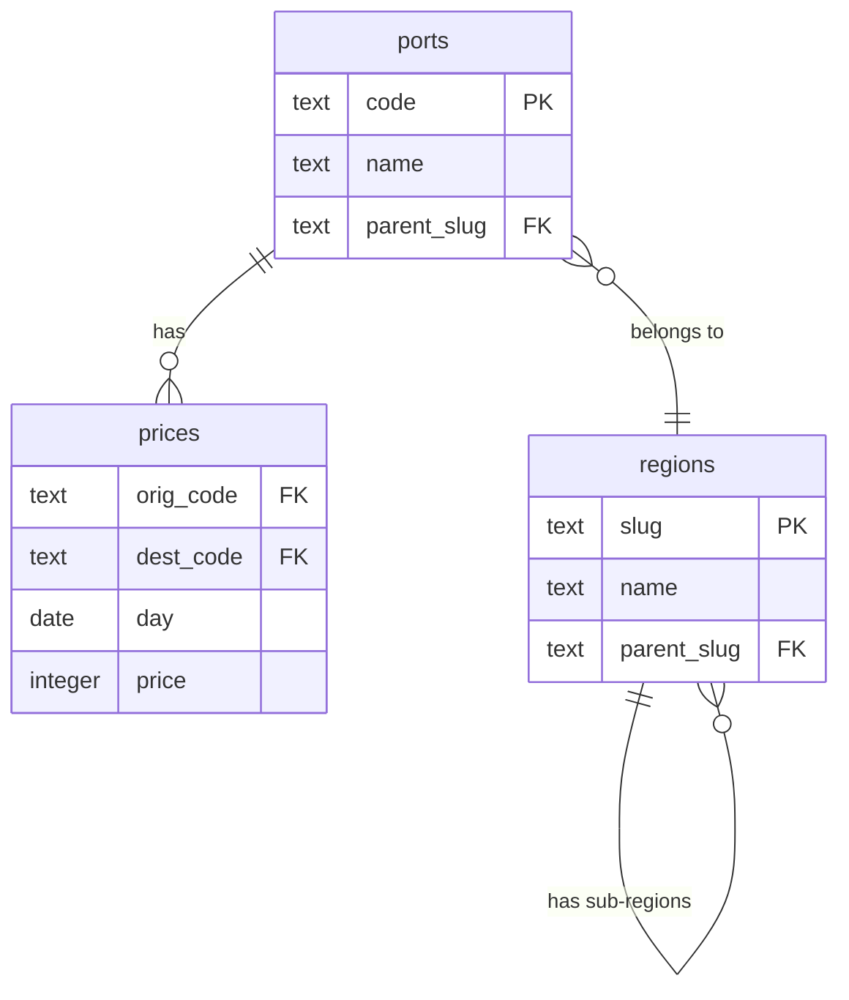

```mermaid
erDiagram
    ports {
        text code PK
        text name
        text parent_slug FK
    }
    prices {
        text orig_code FK
        text dest_code FK
        date day
        integer price
    }
    regions {
        text slug PK
        text name
        text parent_slug FK
    }
    ports ||--o{ prices : "has"
    ports }o--|| regions : "belongs to"
    regions ||--o{ regions : "has sub-regions"
```
